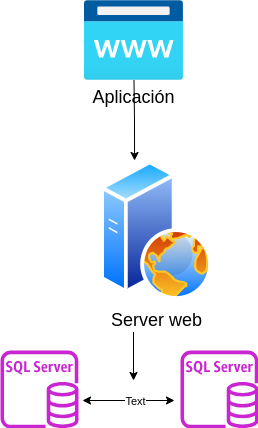

Como crear un cluster Postgres en alta disponibilidad

Para la creación de un cluster postgres de alta disponibilidad, primero analizaremos la arquitectura sugerida.

Para esto, se deberá contar con 2 nodos de postgres, uno será el primario y el otro será secundario. 

Para evitar inconsistencia de datos, tendremos un cluster *file system replication*, donde los ficheros de la base de datos maestra, se replicará en la base de datos secundaria. 

Para esto, es necesario configurar ambos servidores postgres, el maestro con lo siguiente:  
Actualizar el fichero pg_hba.conf con lo siguiente
* agregando "host replication all all trust", para permitir conexiones de replica desde cualquier host. 
* agregando "host all all 0.0.0.0/0 md5" para permitir conexiones desde cualquier host, usando autenticación md5.

Actualizar el fichero postgresql.conf con lo siguiente:
* agregar "wal_level = replica" que permite el nivel de registro de escritura adelantada (wal) necesaria para las replicas. 
* agregar "max_wal_senders = 1"

## Consideraciones

Temas pendientes
1. agregar SSL para las conexiones, por seguridad
2. 

docker exec -it pg-master psql -U postgres -d mydb
docker exec -it pg-slave psql -U postgres -d mydb

CREATE TABLE test (id SERIAL PRIMARY KEY, data TEXT);

INSERT INTO test (data) VALUES ('Hello, World!');

select * from test;